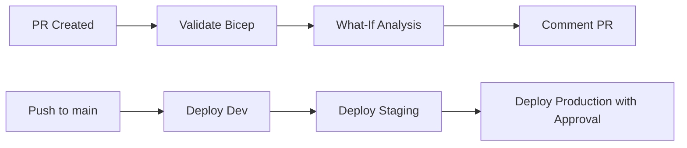

# Azure AI Foundry - Automated Deployment with Bicep, azd & GitHub Actions


Complete infrastructure-as-code solution for deploying **Azure AI Foundry** (Microsoft Foundry) with production-grade security, RBAC, and CI/CD automation.

---

## 📋 Table of Contents

- [Overview](#overview)
- [Architecture](#architecture)
- [Deployment Options](#deployment-options)
- [Repository Structure](#repository-structure)
- [Prerequisites](#prerequisites)
- [Quick Start](#quick-start)
- [Configuration](#configuration)
- [GitHub Actions Workflow](#github-actions-workflow)
- [OIDC Setup](#oidc-setup)
- [What-If on Pull Requests](#what-if-on-pull-requests)
- [Environment Protection](#environment-protection)
- [Troubleshooting](#troubleshooting)
- [Next Steps](#next-steps)

---

## 🎯 Overview

This repository provides a **production-ready** Infrastructure-as-Code (IaC) solution for Azure AI Foundry using:

- **Bicep** for declarative infrastructure
- **Azure Developer CLI (azd)** for interactive multi-subscription deployments
- **GitHub Actions** with OIDC authentication (no stored secrets!)
- **Environment-specific parameters** (dev, staging, production)
- **Automated What-If analysis** on pull requests
- **Multi-environment deployment pipeline** with approval gates

### Key Features

✅ **Multi-subscription support**: Deploy to separate subscriptions per environment  
✅ **Interactive deployment**: azd prompts for subscription/resource group at runtime  
✅ **Security-first design**: RBAC-based Key Vault, managed identities, secure storage  
✅ **Modular Bicep architecture**: Reusable modules for foundry, projects, Key Vault, storage  
✅ **Dual deployment methods**: Choose azd (local) or GitHub Actions (CI/CD)  
✅ **GitOps automation**: PR validation, What-If previews, automated deployments  
✅ **Zero-secret authentication**: GitHub OIDC federation with Azure  

---

## 🏗️ Architecture

### Multi-Subscription Deployment

This solution supports **separate Azure subscriptions** for each environment, providing complete isolation for billing, governance, and security:

```
┌─────────────────────────────────────────────────────────────────┐
│                    DEV Subscription                              │
│  ┌────────────────────────────────────────────────────────────┐ │
│  │  Resource Group: dev-aif-foundry-rg                         │ │
│  │  ┌──────────┐  ┌─────────┐  ┌───────────────────────┐     │ │
│  │  │ Key Vault│  │ Storage │  │   AI Foundry Hub      │     │ │
│  │  └──────────┘  └─────────┘  │   (Managed Identity)  │     │ │
│  │                              └───────┬───────────────┘     │ │
│  │                                ┌─────┴─────┐               │ │
│  │                                │  Projects │               │ │
│  │                                │  (2 projects)             │ │
│  │                                └───────────┘               │ │
│  └────────────────────────────────────────────────────────────┘ │
└─────────────────────────────────────────────────────────────────┘

┌─────────────────────────────────────────────────────────────────┐
│                    STG Subscription                              │
│  ┌────────────────────────────────────────────────────────────┐ │
│  │  Resource Group: stg-aif-foundry-rg                         │ │
│  │  ┌──────────┐  ┌─────────┐  ┌───────────────────────┐     │ │
│  │  │ Key Vault│  │ Storage │  │   AI Foundry Hub      │     │ │
│  │  └──────────┘  └─────────┘  │   (Managed Identity)  │     │ │
│  │                              └───────┬───────────────┘     │ │
│  │                                ┌─────┴─────┐               │ │
│  │                                │  Projects │               │ │
│  │                                │  (2 projects)             │ │
│  │                                └───────────┘               │ │
│  └────────────────────────────────────────────────────────────┘ │
└─────────────────────────────────────────────────────────────────┘

┌─────────────────────────────────────────────────────────────────┐
│                    PROD Subscription                             │
│  ┌────────────────────────────────────────────────────────────┐ │
│  │  Resource Group: prod-aif-foundry-rg                        │ │
│  │  ┌──────────┐  ┌─────────┐  ┌───────────────────────┐     │ │
│  │  │ Key Vault│  │ Storage │  │   AI Foundry Hub      │     │ │
│  │  └──────────┘  └─────────┘  │   (Managed Identity)  │     │ │
│  │                              └───────┬───────────────┘     │ │
│  │                                ┌─────┴─────┐               │ │
│  │                                │  Projects │               │ │
│  │                                │  (3 projects)             │ │
│  │                                └───────────┘               │ │
│  └────────────────────────────────────────────────────────────┘ │
└─────────────────────────────────────────────────────────────────┘
```

### Deployment Benefits

✅ **Complete Isolation**: Separate subscriptions prevent cross-environment access  
✅ **Independent Billing**: Track costs per environment separately  
✅ **Governance**: Apply different policies and compliance rules per environment  
✅ **Security**: Subscription-level security boundaries  

### Components Per Environment

| Component | Purpose | Security |
|-----------|---------|----------|
| **AI Foundry Hub** | Central AI workspace | SystemAssigned managed identity |
| **AI Foundry Projects** | Individual project workspaces (2-3 per env) | SystemAssigned managed identity |
| **Azure AI Services** | OpenAI models (GPT-4o, embeddings) | SystemAssigned managed identity, AAD auth |
| **Key Vault** | Secret/key management | RBAC, soft-delete, purge protection |
| **Storage Account** | Model/data storage with containers | No public access, HTTPS only, TLS 1.2+ |
| **Application Insights** | Monitoring & diagnostics | Performance tracking, logging |

### Subscription Configuration

Each environment is configured in `.azure/<env>/.env`:

```bash
# DEV
AZURE_SUBSCRIPTION_ID="<dev-subscription-id>"
AZURE_LOCATION="eastus"

# STG  
AZURE_SUBSCRIPTION_ID="<stg-subscription-id>"
AZURE_LOCATION="eastus"

# PROD
AZURE_SUBSCRIPTION_ID="<prod-subscription-id>"
AZURE_LOCATION="eastus"
```

---

## 📁 Repository Structure

```
.
├── .github
│   └── workflows
│       └── deploy-foundry.yml       # CI/CD pipeline
├── .azure                            # Azure Developer CLI config
│   ├── config.json                  # azd configuration
│   ├── dev/.env                     # Dev environment variables
│   ├── stg/.env                     # Staging environment variables
│   └── prod/.env                    # Production environment variables
├── infra
│   ├── modules
│   │   ├── foundry.bicep            # AI Foundry Hub module
│   │   ├── project.bicep            # AI Foundry Project module
│   │   ├── aiservices.bicep         # Azure AI Services (OpenAI) module
│   │   ├── appinsights.bicep        # Application Insights module
│   │   ├── kv.bicep                 # Key Vault module
│   │   ├── storage.bicep            # Storage Account module
│   │   ├── tags.bicep               # Tag merging utility
│   │   └── role-assignment.bicep    # RBAC role assignment
│   ├── main.bicep                   # Main orchestrator
│   ├── dev.main.bicepparam          # Dev parameters
│   ├── stg.main.bicepparam          # Staging parameters
│   └── prod.main.bicepparam         # Production parameters
├── azure.yaml                        # Azure Developer CLI project config
├── AZD-DEPLOYMENT-GUIDE.md          # Complete azd deployment guide
├── MULTI-SUBSCRIPTION-SETUP.md      # GitHub Actions multi-sub setup
├── .gitignore
└── README.md
```

---

## 🚢 Deployment Options

This solution supports **two deployment methods**:

### Option 1: Azure Developer CLI (azd) - Interactive Local Deployment

**Best for:**
- ✅ Quick local deployments
- ✅ Interactive subscription selection at runtime
- ✅ Testing infrastructure changes
- ✅ Manual deployments to specific environments
- ✅ Multi-subscription deployments with prompts

**Quick Start:**
```bash
# Install azd
winget install microsoft.azd

# Deploy to dev
azd env select dev
azd up  # Prompts for subscription, location, resource group
```

📖 **[Complete azd Deployment Guide →](AZD-DEPLOYMENT-GUIDE.md)**

### Option 2: GitHub Actions - Automated CI/CD

**Best for:**
- ✅ Automated deployments on git push
- ✅ PR validation with What-If analysis
- ✅ Sequential deployments (dev → stg → prod)
- ✅ Approval gates for production
- ✅ GitOps workflow

**Quick Start:**
```bash
# Set up OIDC (one-time)
# Push to GitHub → Automatic deployment
```

📖 **[GitHub Actions Multi-Subscription Setup →](MULTI-SUBSCRIPTION-SETUP.md)**

---

## ✅ Prerequisites

### For azd Deployment

1. **Azure Developer CLI** ([Install](https://learn.microsoft.com/azure/developer/azure-developer-cli/install-azd))
2. **Azure CLI** ([Install](https://learn.microsoft.com/cli/azure/install-azure-cli))
3. **Azure Subscriptions** (1-3 subscriptions for dev/stg/prod)
4. **Permissions**: Contributor + User Access Administrator on each subscription

### For GitHub Actions Deployment

1. **Azure Subscription(s)** with sufficient permissions
2. **GitHub Repository** to host this code
3. **Azure CLI** installed locally (for OIDC setup)
4. **Bicep CLI** (included with Azure CLI 2.20.0+)

---

## 🚀 Quick Start

### Using Azure Developer CLI (azd)

```bash
# 1. Install azd
winget install microsoft.azd

# 2. Login to Azure
az login

# 3. Deploy to dev environment
azd env select dev
azd up

# When prompted, enter:
# - Dev Subscription ID
# - Azure Location (e.g., eastus)
# - Resource Group Name (e.g., rg-dev-foundry)

# 4. Deploy to staging
azd env select stg
azd up  # Use staging subscription ID

# 5. Deploy to production
azd env select prod
azd up  # Use production subscription ID
```

**✨ That's it! azd handles:**
- ✅ Subscription selection at runtime
- ✅ Resource group creation
- ✅ Infrastructure provisioning
- ✅ Configuration persistence in `.azure/<env>/.env`

📖 **[See complete azd guide with troubleshooting →](AZD-DEPLOYMENT-GUIDE.md)**

### Using GitHub Actions

### 1. Clone Repository

```bash
git clone <your-repo-url>
cd <repo-name>
```

### 2. Configure Parameters

Edit parameter files for your environments:

- `infra/dev.main.bicepparam`
- `infra/stg.main.bicepparam`
- `infra/prod.main.bicepparam`

**Update these values:**

```bicep
param namePrefix = 'your-prefix'      // Change this
param location = 'eastus'             // Your Azure region
param kvName = 'yourkv001'            // Must be globally unique
param storageName = 'yourstorage001'  // Must be globally unique (3-24 lowercase alphanumeric)
param tags = {
  env: 'dev'
  owner: 'your-email@company.com'     // Change this
  costCenter: 'CC-YOUR-TEAM'          // Change this
}
```

### 3. Set Up OIDC (see detailed steps below)

```bash
# See "OIDC Setup" section
```

### 4. Push to GitHub

```bash
git add .
git commit -m "Initial Azure AI Foundry setup"
git push origin main
```

GitHub Actions will automatically deploy to dev → stg → prod (with approval gates).

---

## ⚙️ Configuration

### Parameter Files Explained

Each environment has a `.bicepparam` file with these key parameters:

| Parameter | Description | Example |
|-----------|-------------|---------|
| `namePrefix` | Prefix for all resources | `dev-aif`, `prod-aif` |
| `location` | Azure region | `eastus`, `westeurope` |
| `tags` | Resource tags | `{ env: 'dev', owner: 'team@co.com' }` |
| `projects` | Array of AI projects | `[{ name: 'chatbot', description: '...' }]` |
| `kvName` | Key Vault name | `devkv001` (must be globally unique) |
| `storageName` | Storage account name | `devstorage001` (3-24 chars, lowercase) |
| `aiServicesName` | AI Services account name | `devaiservices001` (globally unique) |
| `aiServicesDeployments` | OpenAI model deployments | Array of models with versions & capacity |
| `appInsightsName` | Application Insights name | `devappinsights001` |
| `connectionAuthType` | AI Services auth method | `AAD` (recommended) or `ApiKey` |
| `resourceGroupName` | Resource group name | `dev-aif-foundry-rg` |

### Adding Projects

To add a new project, edit the `projects` array:

```bicep
param projects = [
  {
    name: 'chatbot'
    description: 'Customer service chatbot'
  }
  {
    name: 'analytics'
    description: 'Data analytics AI'
  }
  {
    name: 'newproject'  // Add here
    description: 'New AI project'
  }
]
```

---

## 🔄 GitHub Actions Workflow

### Triggers

| Event | Action | Environments |
|-------|--------|--------------|
| **Pull Request** → `main` | Validate + What-If (all envs) | dev, stg, prod |
| **Push** → `main` | Deploy sequentially | dev → stg → prod |
| **Manual Dispatch** | Deploy specific environment | User selects |

### Pipeline Flow



### Jobs

1. **validate**: Validates Bicep syntax and parameter binding (matrix: dev/stg/prod)
2. **whatif**: Runs What-If to preview changes, uploads artifacts, comments on PR
3. **deploy-dev**: Deploys to dev environment automatically
4. **deploy-stg**: Deploys to staging after dev succeeds
5. **deploy-prod**: Deploys to production after staging (requires approval)
6. **deploy-manual**: Triggered via workflow_dispatch for ad-hoc deployments

---

## 🔐 OIDC Setup

### Why OIDC?

- **No secrets in GitHub**: No client secrets, passwords, or keys stored
- **Short-lived tokens**: Tokens expire automatically
- **Better security**: Azure verifies the GitHub token on each request

### Setup Steps

#### 1. Register Azure AD Application

```bash
# Login to Azure
az login

# Set subscription
az account set --subscription "<your-subscription-id>"

# Create Azure AD App Registration
az ad app create --display-name "GitHub-OIDC-AzureFoundry"

# Get the Application (client) ID
appId=$(az ad app list --display-name "GitHub-OIDC-AzureFoundry" --query "[0].appId" -o tsv)
echo "Client ID: $appId"

# Get Object ID
objectId=$(az ad app list --display-name "GitHub-OIDC-AzureFoundry" --query "[0].id" -o tsv)
echo "Object ID: $objectId"
```

#### 2. Create Service Principal

```bash
# Create service principal
az ad sp create --id $appId

# Get the Service Principal ID
spId=$(az ad sp list --display-name "GitHub-OIDC-AzureFoundry" --query "[0].id" -o tsv)

# Assign Contributor role at subscription level
az role assignment create \
  --assignee $appId \
  --role "Contributor" \
  --scope "/subscriptions/<your-subscription-id>"

# Assign User Access Administrator (needed for RBAC assignments)
az role assignment create \
  --assignee $appId \
  --role "User Access Administrator" \
  --scope "/subscriptions/<your-subscription-id>"
```

#### 3. Configure Federated Credentials

Replace `<YOUR_GITHUB_ORG>` and `<YOUR_REPO_NAME>`:

```bash
# For main branch
az ad app federated-credential create \
  --id $objectId \
  --parameters '{
    "name": "github-main-branch",
    "issuer": "https://token.actions.githubusercontent.com",
    "subject": "repo:<YOUR_GITHUB_ORG>/<YOUR_REPO_NAME>:ref:refs/heads/main",
    "audiences": ["api://AzureADTokenExchange"]
  }'

# For pull requests
az ad app federated-credential create \
  --id $objectId \
  --parameters '{
    "name": "github-pull-requests",
    "issuer": "https://token.actions.githubusercontent.com",
    "subject": "repo:<YOUR_GITHUB_ORG>/<YOUR_REPO_NAME>:pull_request",
    "audiences": ["api://AzureADTokenExchange"]
  }'

# For environment (optional, for protected environments)
az ad app federated-credential create \
  --id $objectId \
  --parameters '{
    "name": "github-env-prod",
    "issuer": "https://token.actions.githubusercontent.com",
    "subject": "repo:<YOUR_GITHUB_ORG>/<YOUR_REPO_NAME>:environment:prod",
    "audiences": ["api://AzureADTokenExchange"]
  }'
```

#### 4. Add GitHub Secrets

Go to your GitHub repository → **Settings** → **Secrets and variables** → **Actions** → **New repository secret**

Add these secrets:

| Secret Name | Value | How to Get |
|-------------|-------|------------|
| `AZURE_CLIENT_ID` | `<appId from step 1>` | Application (client) ID |
| `AZURE_TENANT_ID` | `<tenant-id>` | `az account show --query tenantId -o tsv` |
| `AZURE_SUBSCRIPTION_ID` | `<subscription-id>` | Your subscription ID |

#### 5. Verify OIDC

```bash
# Test locally with Azure CLI
az login --service-principal \
  --username $appId \
  --tenant <tenant-id> \
  --federated-token "$(curl -H 'Authorization: bearer $ACTIONS_ID_TOKEN_REQUEST_TOKEN' \
  '$ACTIONS_ID_TOKEN_REQUEST_URL&audience=api://AzureADTokenExchange' | jq -r '.value')"
```

---

## 🔍 What-If on Pull Requests

When you create a PR that modifies infrastructure files, the workflow automatically:

1. **Validates** all Bicep templates
2. **Runs What-If** for dev, stg, and prod environments
3. **Uploads artifacts** containing What-If results
4. **Comments on PR** with expandable What-If analysis

### Example PR Comment

```
## What-If Analysis: dev

<details>
<summary>Click to expand What-If results</summary>

Resource changes: 5 to create, 2 to modify, 0 to delete

+ Microsoft.MachineLearningServices/workspaces
  Location: eastus
  Kind: Hub
  
~ Microsoft.KeyVault/vaults
  - enablePurgeProtection: false
  + enablePurgeProtection: true

</details>
```

### Reviewing What-If Results

Before merging:

1. Expand What-If sections in PR comments
2. Verify expected changes
3. Check for unintended modifications or deletions
4. Download artifacts from Actions tab for detailed review

---

## 🔒 Environment Protection

### Configuring Production Approval

1. Go to **Settings** → **Environments** → **New environment**
2. Create environment: `prod`
3. Enable **Required reviewers**
4. Add team members who can approve production deployments
5. (Optional) Set **Wait timer** to delay deployments

### Deployment Flow

```
┌──────┐     ┌─────────┐     ┌────────────────┐
│ Dev  │────▶│ Staging │────▶│ Production     │
│ Auto │     │  Auto   │     │ (Needs Approval)│
└──────┘     └─────────┘     └────────────────┘
```

- **Dev**: Deploys automatically on push to main
- **Staging**: Deploys after dev succeeds
- **Production**: Waits for manual approval

---

## 🛠️ Troubleshooting

### Issue: `Resource name already exists`

**Cause**: Key Vault or Storage Account names must be globally unique.

**Solution**: Change `kvName` and `storageName` in parameter files:

```bicep
param kvName = 'yourcompany-dev-kv-001'  // Add company prefix
param storageName = 'yourcompanydevstor001'
```

### Issue: `OIDC authentication failed`

**Cause**: Federated credentials not configured correctly.

**Solution**:
1. Verify subject matches your repo: `repo:owner/repo:ref:refs/heads/main`
2. Check GitHub secrets are correct (CLIENT_ID, TENANT_ID, SUBSCRIPTION_ID)
3. Ensure service principal has Contributor + User Access Administrator roles

### Issue: `Insufficient permissions to assign role`

**Cause**: Service principal lacks `User Access Administrator` role.

**Solution**:

```bash
az role assignment create \
  --assignee $appId \
  --role "User Access Administrator" \
  --scope "/subscriptions/<subscription-id>"
```

### Issue: `Deployment validation failed`

**Cause**: Bicep syntax errors or missing required parameters.

**Solution**:
1. Run locally: `az deployment sub validate --location eastus --template-file infra/main.bicep --parameters infra/dev.main.bicepparam`
2. Check validation job logs in GitHub Actions
3. Verify all required parameters are provided in `.bicepparam` files

### Issue: `Key Vault name contains invalid characters`

**Cause**: Key Vault names must be 3-24 alphanumeric characters and hyphens.

**Solution**: Update `kvName`:

```bicep
param kvName = 'dev-aif-kv-001'  // Valid: alphanumeric + hyphens
```

### Issue: `Storage account name must be between 3 and 24 characters`

**Cause**: Storage names must be 3-24 lowercase letters and numbers only (no hyphens).

**Solution**:

```bicep
param storageName = 'devaifstorage001'  // Valid: 18 chars, lowercase
```

---

## 🚀 Next Steps

### 1. Enable Private Endpoints

Update modules to disable public access and add private endpoints:

```bicep
// In storage.bicep
publicNetworkAccess: 'Disabled'

// Add private endpoint
resource storagePrivateEndpoint 'Microsoft.Network/privateEndpoints@2023-04-01' = {
  name: '${storageName}-pe'
  location: location
  properties: {
    subnet: { id: subnetId }
    privateLinkServiceConnections: [...]
  }
}
```

### 2. Add Diagnostic Settings

Enable logging to Log Analytics or Storage:

```bicep
resource diagnostics 'Microsoft.Insights/diagnosticSettings@2021-05-01-preview' = {
  name: 'foundry-diagnostics'
  scope: foundryHub
  properties: {
    workspaceId: logAnalyticsWorkspaceId
    logs: [
      { category: 'AmlComputeClusterEvent', enabled: true }
      { category: 'AmlComputeJobEvent', enabled: true }
    ]
  }
}
```

### 3. Implement Deployment Stacks

Use Azure Deployment Stacks for better lifecycle management:

```bash
az stack sub create \
  --name foundry-dev-stack \
  --location eastus \
  --template-file infra/main.bicep \
  --parameters infra/dev.main.bicepparam \
  --deny-settings-mode none
```

### 4. Add Application Insights

Enhance observability:

```bicep
resource appInsights 'Microsoft.Insights/components@2020-02-02' = {
  name: '${namePrefix}-appi'
  location: location
  kind: 'web'
  properties: {
    Application_Type: 'web'
    WorkspaceResourceId: logAnalyticsWorkspace.id
  }
}
```

### 5. Configure Azure Policy

Enforce governance with policies:

```bash
# Assign built-in policy: Require tags
az policy assignment create \
  --name 'require-tags' \
  --policy '/providers/Microsoft.Authorization/policyDefinitions/...' \
  --scope "/subscriptions/<subscription-id>"
```

### 6. Set Up Cost Alerts

Monitor spending:

```bash
az consumption budget create \
  --budget-name 'foundry-monthly-budget' \
  --amount 1000 \
  --time-grain Monthly \
  --start-date 2025-01-01 \
  --end-date 2026-01-01
```

### 7. Add Container Registry

For custom AI models and containers:

```bicep
resource acr 'Microsoft.ContainerRegistry/registries@2023-07-01' = {
  name: '${namePrefix}acr'
  location: location
  sku: { name: 'Premium' }
  properties: {
    adminUserEnabled: false
    publicNetworkAccess: 'Enabled'
  }
}
```

### 8. Integrate with Azure DevOps

Alternative to GitHub Actions:

```yaml
# azure-pipelines.yml
trigger:
  branches:
    include:
      - main

pool:
  vmImage: 'ubuntu-latest'

steps:
  - task: AzureCLI@2
    inputs:
      azureSubscription: 'Azure-Service-Connection'
      scriptType: 'bash'
      scriptLocation: 'inlineScript'
      inlineScript: |
        az deployment sub create \
          --location eastus \
          --template-file infra/main.bicep \
          --parameters infra/dev.main.bicepparam
```

---

## 📚 Additional Resources

- [Azure AI Foundry Documentation](https://learn.microsoft.com/azure/ai-studio/)
- [Bicep Documentation](https://learn.microsoft.com/azure/azure-resource-manager/bicep/)
- [GitHub OIDC with Azure](https://docs.github.com/actions/deployment/security-hardening-your-deployments/configuring-openid-connect-in-azure)
- [Azure Machine Learning Service](https://learn.microsoft.com/azure/machine-learning/)

---

## 📝 License

MIT License - see LICENSE file for details.

---

## 🤝 Contributing

Contributions welcome! Please:

1. Fork the repository
2. Create a feature branch
3. Make your changes
4. Submit a pull request

---

## 📧 Support

For issues or questions:

- Open a GitHub Issue
- Contact: your-team@company.com

---

**Built with ❤️ using Azure Bicep and GitHub Actions**
